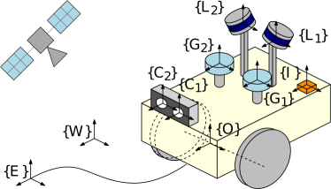
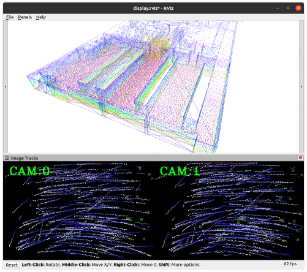
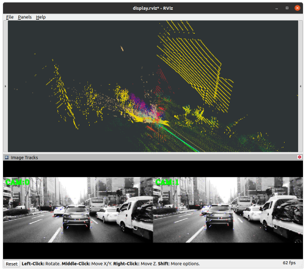
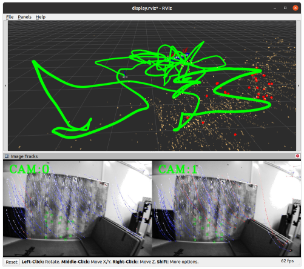

# MINS
[](https://github.com/rpng/MINS/actions/workflows/build_ros1.yml)
[](https://github.com/rpng/MINS/actions/workflows/build_ros2.yml)
[](https://github.com/rpng/MINS/actions/workflows/build_rosfree.yml)
[](https://github.com/rpng/MINS/actions/workflows/build_macos.yml)
[](https://github.com/rpng/MINS/actions/workflows/build_windows.yml)

An efficient, robust, and tightly-coupled **Multisensor-aided Inertial Navigation System (MINS)** which is capable of 
flexibly fusing all five sensing modalities (**IMU**, **wheel** **encoders**, **camera**, **GNSS**, and **LiDAR**) in a filtering 
fashion by overcoming the hurdles of computational complexity, sensor asynchronicity, and intra-sensor calibration. 

Exemplary use case of MINS: 
* VINS (mono, stereo, multi-cam)
* GPS-IMU (single, multiple)
* LiDAR-IMU (single, multiple)
* wheel-IMU
* Camera-GPS-LiDAR-wheel-IMU or more combinations.




* Publication reference - [https://arxiv.org/pdf/2309.15390.pdf](https://arxiv.org/pdf/2309.15390.pdf)
  
## Key Features
* Inertial(IMU)-based multi-sensor fusion including wheel odometry and arbitrary numbers of cameras, LiDARs, and GNSSs (+ VICON or loop-closure) for localization.
* Online calibration of all onboard sensors (check [exemplary results](https://github.com/rpng/mins/blob/master/mins_eval/ReadMe.md#run-example)).
* Consistent high-order state on manifold interpolation improved from our prior work ([MIMC-VINS](https://ieeexplore.ieee.org/abstract/document/9363450)) and dynamic cloning strategy for light-weight estimation performance.
* Multi-sensor simulation toolbox for IMU, camera, LiDAR, GNSS, and wheel enhanced from our prior work ([OpenVINS](https://github.com/rpng/open_vins))
* Evaluation toolbox for consistency, accuracy, and timing analysis.
* Very detailed [options](https://github.com/rpng/mins/tree/master/mins/src/options) for each sensor enabling general multi-sensor application.

## Dependency
MINS is tested on Ubuntu 18 and 20 and only requires corresponding ROS ([Melodic](https://wiki.ros.org/melodic) and [Noetic](https://wiki.ros.org/noetic)).

## ROS2

For instructions and dependencies for building the package on ros2 you can look into the Dockerfile. After building and sourcing, you should be able to start the simulation with 

```sh
ros2 run mins simulation mins/config/simulation/config.yaml
```

You can then start rviz2 to look at the path as estimated through MINS.

For running in real mode you can use:

```sh
ros2 run mins subscribe mins/config/euroc_mav/config.yaml
```

And then play a bag in another terminal, for example from the [euroc_mav](https://projects.asl.ethz.ch/datasets/doku.php?id=kmavvisualinertialdatasets), after converting it using [rosbags](https://pypi.org/project/rosbags/):

```sh
ros2 bag play data/MH_01_easy
```

Again, you can look at the paths and the pose estimated by MINS with rviz2.


## Build and Source
```
mkdir -p $MINS_WORKSPACE/catkin_ws/src/ && cd $MINS_WORKSPACE/catkin_ws/src/
git clone https://github.com/rpng/MINS
cd .. && catkin build
source devel/setup.bash
```

## Run Examples
### Simulation 
```roslaunch mins simulation.launch cam_enabled:=true lidar_enabled:=true```




### Real-World Dataset
#### Directly reading the ros bag file
```roslaunch mins rosbag.launch config:=kaist/kaist_LC path_gt:=urban30.txt path_bag:=urban30.bag```



Here are the rosbag files and ground truths we used in the evaluation. To be specific, we used [kaist2bag](https://github.com/tsyxyz/kaist2bag) to convert all sensor readings to rosbag files. All rights reserved to [KAIST urban dataset](https://sites.google.com/view/complex-urban-dataset).

We provide mirrors of the converted rosbags (`urban18`-`urban39`) and their ground truths at the links below:
* [Hugging Face - kaist-urban-dataset](https://huggingface.co/datasets/gladiator7737/kaist-urban-dataset)
* [UD Robots NAS](https://gofile.me/7B392/kNl7XHqHx) (scan the QR code below)


#### Subscribing to the ros messages
```roslaunch mins subscribe.launch config:=euroc_mav rosbag:=V1_03_difficult.bag bag_start_time:=0```



### RViz
```rviz -d mins/launch/display.rviz```

## Acknowledgements
This project was built on top of the following libraries which are in the thirdparty folder.
* [OpenVINS](https://github.com/rpng/open_vins): Open-source filter-based visual-inertial estimator.
* [ikd-tree](https://github.com/hku-mars/ikd-Tree): Incremental k-d tree.

## Credit / Licensing


This code was written by the [Robot Perception and Navigation Group (RPNG)](https://sites.udel.edu/robot/) at the
University of Delaware. If you have any issues with the code please open an issue on our GitHub page with relevant
implementation details and references. For researchers that have leveraged or compared to this work, please cite the
following:

The publication reference will be updated soon.

```bibtex
@article{Lee2023arxiv,
    title        = {MINS: Efficient and Robust Multisensor-aided Inertial Navigation System},
    author       = {Woosik Lee and Patrick Geneva and Chuchu Chen and Guoquan Huang},
    year         = 2023,
    journal      = {arXiv preprint arXiv:2309.15390},
    url          = {https://github.com/rpng/MINS},
}
```

The codebase and documentation is licensed under the [GNU General Public License v3 (GPL-3)](https://www.gnu.org/licenses/gpl-3.0.txt).
You must preserve the copyright and license notices in your derivative work and make available the complete source code with modifications under the same license ([see this](https://choosealicense.com/licenses/gpl-3.0/); this is not legal advice).
