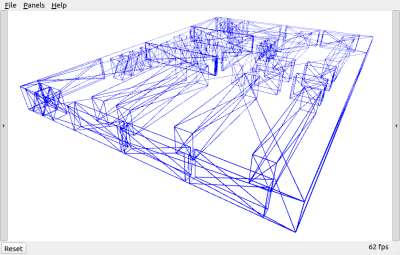
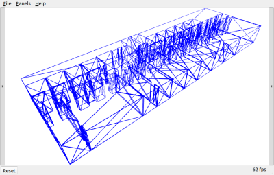

# MINS Data

This package provides dataset for MINS simulation. 
Specifically, it contains forders: `BSplineDataset`, `FloorPlans`, and `GroundTruths`.

## BSplineDataset
This folder contains trajectory files MINS use to construct B-Spline for its simulation. 
The files include:
[EuRoC MAV Dataset](https://journals.sagepub.com/doi/full/10.1177/0278364915620033), 
[TUM VI Dataset](https://arxiv.org/abs/2108.07329), 
and UD dataset:
```
 EuRoC 
    Machine Hall 01 - 05
    Vicon Room 1 01 - 03
    Vicon Room 2 01 - 03
 TUM 
    Corridor 01
    Magistrale 01
    Room 01 - 06
 UD 
    Ground vehicle: Garage, Neighbor
    Simulated motion: Dynamic, Small, Spencer, Warehouse
    Human 3D motion: Gore
```

## FloorPlans
`FloorPlans` contains pre-defined plane information that can be used with `BSplineDataset` that is used to simulate LiDAR pointcloud.
MINS simulator will try to find `FloorPlans` file that has the same name of `BSplineDataset` file when LiDAR simulation is enabled.
`UD_Warehouse` and `UD_Spencer` are currently provided.




## GroundTruths
`GroundTruths` contains the ground truth trajectory generated in 1000 Hz. 
Note the `BSplineDataset` is not exactly the ground truth of simulated trajectory, as `BSplineDataset` is being used to construct B-Spline.
Specifically, the folder contains 3 different types of ground truth files:
* `holonomic`: ground truths of general 3D motion simulation
* `nonholonomic`: ground truths of nonholonomic motion (heading of the vehicle should align with the direction of motion) motion simulation. Mostly for simulation includes wheel odometry sensor.
* `nonholonomic_planar`: ground truths of nonholonomic motion + planar motion simulation. Mostly for simulation includes wheel odometry sensor.

The ground truth files can be downloaded by: ```git submodule update --init --recursive```