# MINS Eval

This package provides toolkit for evaluation of MINS and other algorithms. 
Specifically, it has two evaluation tool: `plot_consistency` and `run_comparison`.

## Dependency (optional)
To get figures, it requires `matplotlib` as dependency:

``sudo apt-get install python-matplotlib python-numpy python-dev``

## Plot Consistency Figures
This function reads the ground truth, state estimation, and state covariance information and plots consistency figures.
Note you can get these by running MINS simulation with ros parameter `sys_save_state = true`.
3 parameters are required to run the function: `load_path`, `save_path`, `visualize`.
In the `load_path`, the structure is assumed to be:
```angular2html
load_path/
    0/
        imu_est.txt
        imu_gt.txt
        imu_std.txt
        cam0_ext_est.txt
        cam0_ext_gt.txt
        cam0_ext_std.txt
        ... (if you have more calibrations)
    1/
        imu_est.txt
        imu_gt.txt
        imu_std.txt
        cam0_ext_est.txt
        cam0_ext_gt.txt
        cam0_ext_std.txt
        ... (if you have more calibrations)
    ... (if you have more runs)
```
which all of them has 3-tuple of files (`*_gt.txt`, `*_est.txt`, `*_std.txt`).

`save_path` is where you save the figures (`save_path/Plot`) and `visualize` is whether you show the figures (both requires `matplotlib`).

### Run (example)
The examplary run command:
```angular2html
roslaunch mins_eval plot_consistency.launch load_path:="../outputs" save_path:="../outputs" visualize:="true"
```
The figures you can expect depends on the estimated state:
* IMU state consistnecy (default)

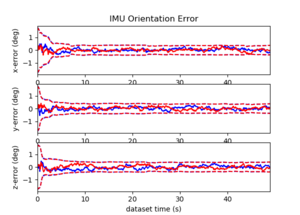
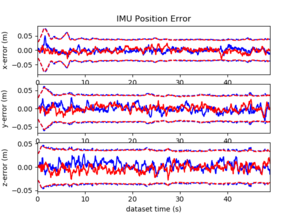
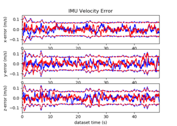
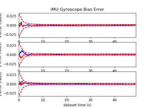
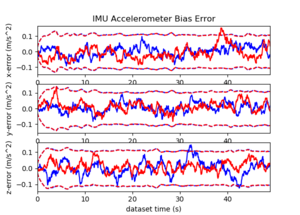

* Camera calibration (can be multiple)

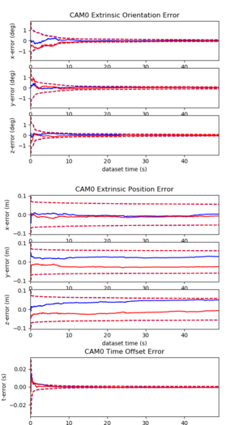
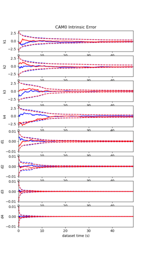

* GNSS calibration (can be multiple)

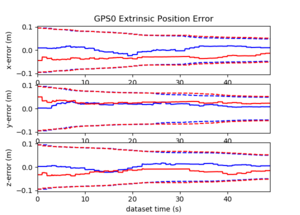
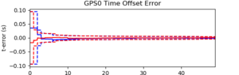

* LiDAR calibration (can be multiple)

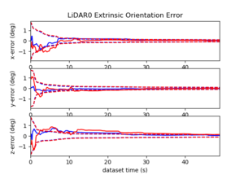
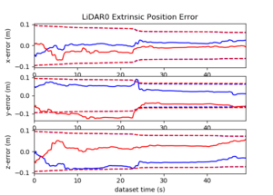
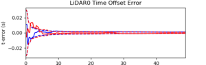

* Wheel calibration (only one allowed)

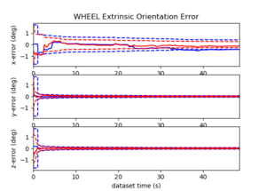
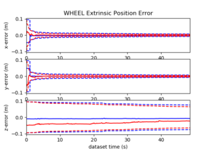
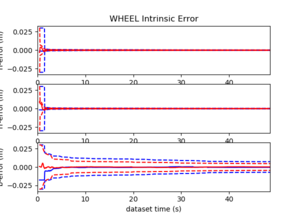
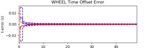

* VICON calibration (can be multiple)

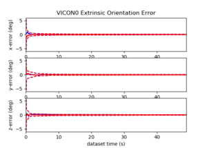
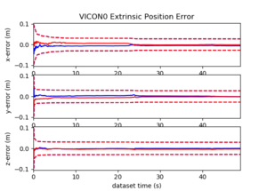
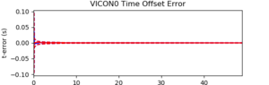

## Algorithm Comparison
This function provides comprehensive ATE, RPE, NEES, and timing comparison analysis among algorithms.
4 parameters are required to run the function: `align_mode`, `path_alg`, `path_gts`, `viz_type`.
* `align_mode`: method to align estimated trajectory and ground truth trajectory to compute the errors.
* `path_alg`: path the algorithms. It expects the following file structure:
    ```angular2html
    path_alg/
        algorithm_name_1/
            dataset_name_1/
                0.txt
                0.time
                1.txt
                1.time
                ... (if you have more runs)
            dataset_name_2/
                0.txt
                0.time
                1.txt
                1.time
                ... (if you have more runs)
            ... (if you have more datasets)
        algorithm_name_2/
            dataset_name_1/
                0.txt
                0.time
                1.txt
                1.time
                ... (if you have more runs)
            dataset_name_2/
                0.txt
                0.time
                1.txt
                1.time
                ... (if you have more runs)
            ... (if you have more datasets)
        ... (if you have more algorithms)
    ```
    Note the names `algorithm_name`, `dataset_name`, `0`, or `1` can be completely arbitrary, but the structure and the extensions (`*.txt` and `*.time`) should be strictly followed.
    Also, timing files (`*.time`) are optional.

* `path_gts`: path to the ground truth files
* `viz_type`: output format of the analysis:
  * `viz_type = 0`: Print ATE, NEES, and TIME in Latex table format
  * `viz_type = 1`: Print RPE of all trajecotry (averages all trajectories) in Latex table format
  * `viz_type = 2`: Print ATE in Latex table format
  * `viz_type = 3`: Print ATE and time in matlab format
  * `viz_type = 4`: Print ATE, NEES, and time in Markdown format (github)
  * `viz_type = 5`: Print ATE in matlab format
  * `viz_type = 6`: Print RPE in Latex table format
  * `viz_type = 7`: Print RPE median error in Latex table format
  * `viz_type = 8`: Print ATE divided by the length of the trajectory (unit 1km) in Latex table format

### Run (example)
The exemplary run command:
```angular2html
roslaunch mins_eval comparison.launch align_mode:=se3 path_alg:=outputs/ path_gts:=mins_data/GroundTruths/holonomic viz_type:=4
```
<table>
 <tr><th><sub></sub></th>
<sub><th colspan="3"><sub><b>EUROC_V12</b></sub></th></sub>
<sub><th colspan="3"><sub><b>UD_Small</b></sub></th></sub>
</tr>
<tr><th></th>
<td align="center"><sub><b> RMSE (deg / m) </b></sub></td>
<td align="center"><sub><b>      NEES      </b></sub></td>
<td align="center"><sub><b>    Time (s)    </b></sub></td>
<td align="center"><sub><b> RMSE (deg / m) </b></sub></td>
<td align="center"><sub><b>      NEES      </b></sub></td>
<td align="center"><sub><b>    Time (s)    </b></sub></td>
</tr>
<tr><td align="center"><sub><b>MINS_IC</b></sub></td><td align="center"><sub>0.277 ± 0.003 / 0.045 ± 0.012 </sub></td><td align="center"><sub>3.5 ± 0.8 / 3.5 ± 1.6</sub></td><td align="center"><sub>64.8 ± 2.3</sub></td><td align="center"><sub><b>0.294</b> ± 0.075 / 0.059 ± 0.002 </sub></td><td align="center"><sub>4.4 ± 1.0 / 3.4 ± 1.5</sub></td><td align="center"><sub>43.4 ± 0.6</sub></td></tr>
<tr><td align="center"><sub><b>MINS_IL</b></sub></td><td align="center"><sub><b>0.238</b> ± 0.015 / <b>0.037</b> ± 0.005 </sub></td><td align="center"><sub>1.5 ± 0.3 / 1.3 ± 0.9</sub></td><td align="center"><sub>80.6 ± 2.2</sub></td><td align="center"><sub>0.321 ± 0.088 / <b>0.041</b> ± 0.015 </sub></td><td align="center"><sub>2.3 ± 0.7 / 1.0 ± 0.4</sub></td><td align="center"><sub>68.1 ± 0.1</sub></td></tr>
</table>

